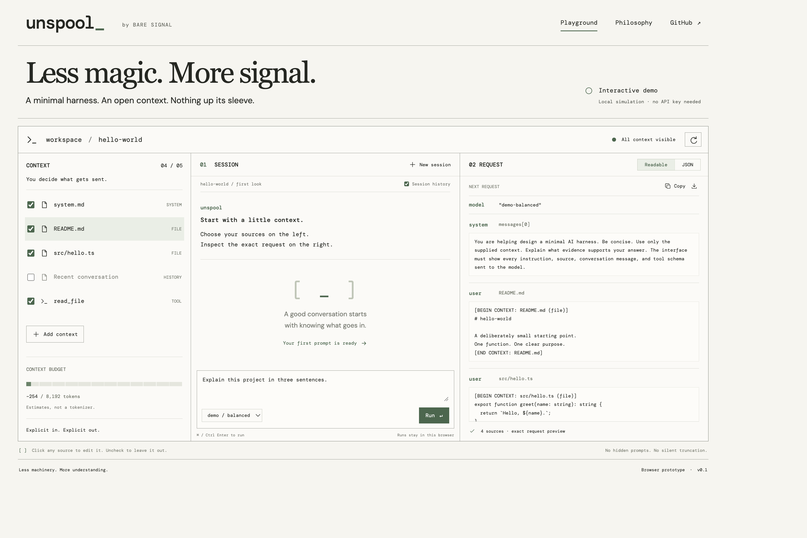

# Unspool

**See what you send.** A minimal AI harness by **Bare Signal**.

[Open the interactive demo](https://dual1208.github.io/unspool/)

Unspool is a minimal AI harness for developers who want to control exactly what a model receives. A harness is the software around a model that prepares its input and manages the conversation. Unspool lets you choose and edit instructions, files, conversation history, and tool definitions, then inspect the complete request before a run. Each run preserves its original request so you can review, copy, or export it later.

The design keeps context engineering understandable: three panes, plain text, and a few deliberate controls. Every context change is visible. The current browser demo uses a local simulation to demonstrate this workflow; the planned product brings it to a terminal interface with a real model connection.

[Read the full product description](docs/PRODUCT.md)



## Try it

1. Toggle a source. It immediately enters or leaves the assembled request.
2. Click its name to edit its contents, type, inclusion, or order. Save applies changes; Cancel discards them.
3. Write a prompt. The **Readable** and **JSON** views expose the complete request, including model, messages, delimiters, and tool schemas.
4. Choose whether to include session history, then run with the button or **⌘ / Ctrl + Enter**.
5. Inspect the preserved request for any run. Copy it or download the complete JSON. Later context edits do not change earlier snapshots.

When viewing a previous snapshot, **Review next** returns to the live request before a new run can start. Invalid tool schemas block runs and surface an error. Oversized context is never silently truncated.

## What this prototype does

This is a **deterministic local simulation**, not a connected model or an installed TUI. No inference requests are made, tools are not executed, and sample files are editable text blocks rather than files read from your machine. The simulation reports the contents of the exact request shown by the interface.

Your context, conversation, and request snapshots are saved in this browser's local storage. Reset restores the seeded example. Token counts use a deliberately simple `ceil(characters / 4)` estimate over the serialized request; the 8,192-token budget is illustrative, not a model limit or enforcement mechanism.

The app bundles its fonts and has no analytics, external font requests, or runtime API dependencies. The static host still receives ordinary page and asset requests.

## Run locally

Node.js 22.18+ is required; Node.js 24 is used in CI.

```sh
npm ci
npm run dev
```

```sh
npm test       # request integrity and simulation behavior
npm run build # TypeScript check and production bundle
npm run preview
```

## Small by design

- `src/lib/context.ts` — pure request assembly, visible seed data, and local simulation.
- `src/App.tsx` — session state, local persistence, snapshots, and layout.
- `src/components/` — context editor, source list, and complete request inspector.
- `src/styles.css` — responsive layout and visual tokens.

No backend, router, UI framework, orchestration layer, or external AI SDK is needed for the demonstration. React and Vite keep the interactive prototype straightforward.

## Design and direction

- [Product philosophy and eventual TUI scope](docs/PHILOSOPHY.md)
- [Working company and product names](docs/NAMING.md)
- [Design reference and verification](docs/design/NOTES.md)

Bare Signal and Unspool are working names with existing uses in other markets; the naming note records the initial search and its limits.

## Deployment

The GitHub Actions workflow builds and checks every pull request and push. Pushes to `main` publish `dist/` to GitHub Pages. Enable Pages with the **GitHub Actions** source when deploying a fork. Relative asset paths allow the built app to work under a repository subpath.
